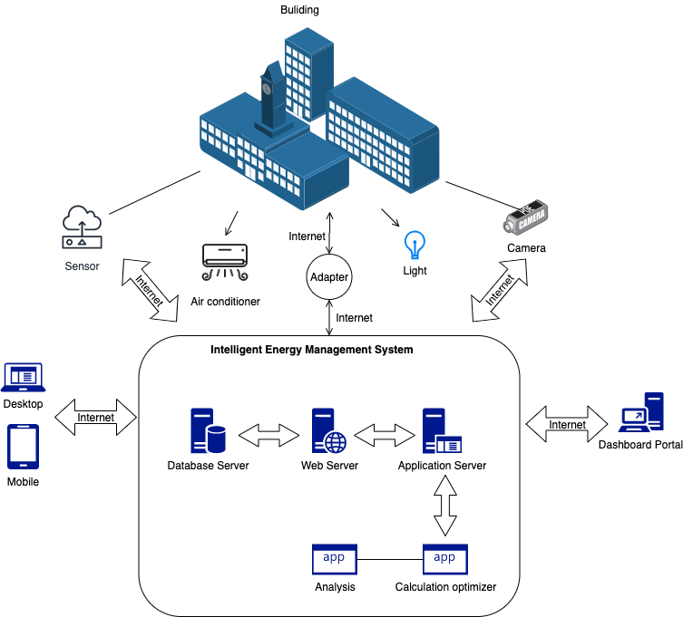
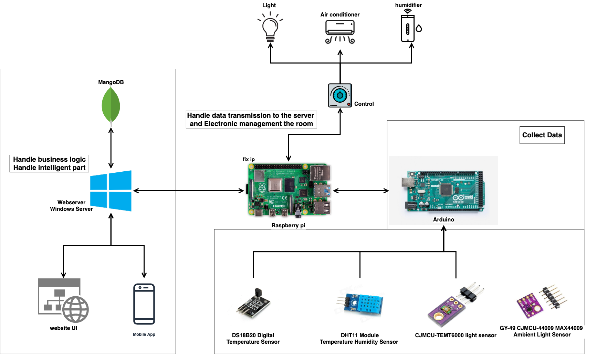

# Intelligent Energy Management System for Buildings INB

### Features
Retrieval of regional weather data from the existing OpenAPI (OpenWeatherMap), storing to DB for further analysis;

Retrieval of outdoor weather data through Arduino  sensors installed outside the building, storing to DB for further analysis;

Retrieval of indoor conditions through several IoT devices, the Arduino  sensors installed inside the rooms of the building to get data of the room and control by Raspberry Pi and return data to the server;

Device control of lights and temperature by configured rule and artificial intelligence, change based on the analyzed regional and outdoor weather data, as well as indoor sensors and system rules.

Dashboard interface for authorized users to view the building conditions and manage rules, with the import of timetables from the existing system(s).

Power saving report and power-saving plan based on data analysis, reporting of electrical energy usage, visualize form for using data analysis.

## System Architecture

> System architeture design

### Hardware Diagram

> Hardware design
