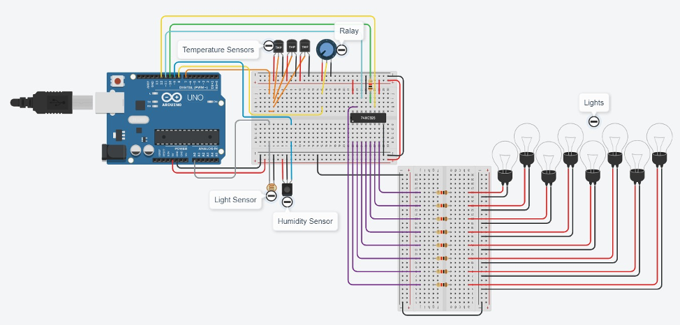
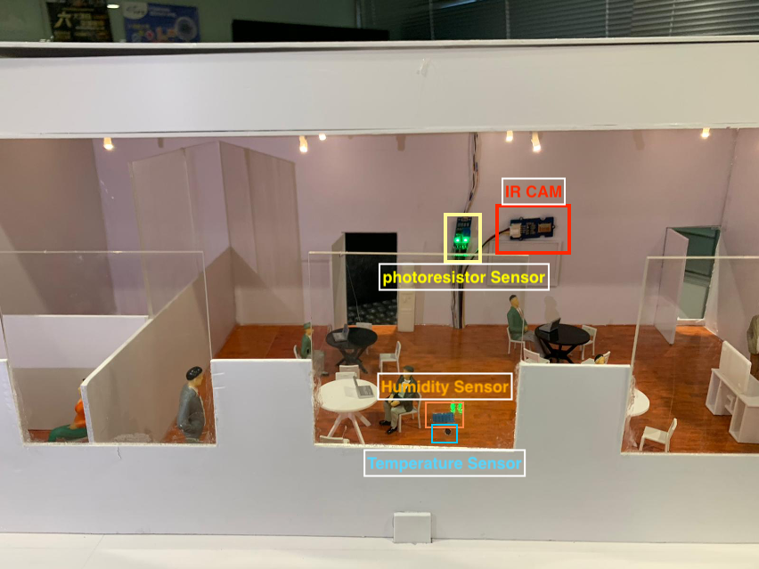
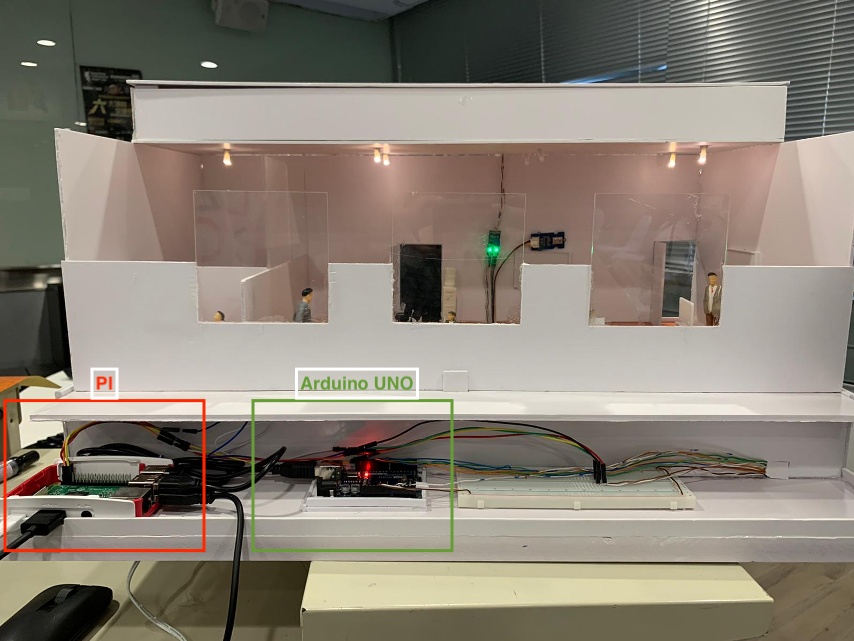
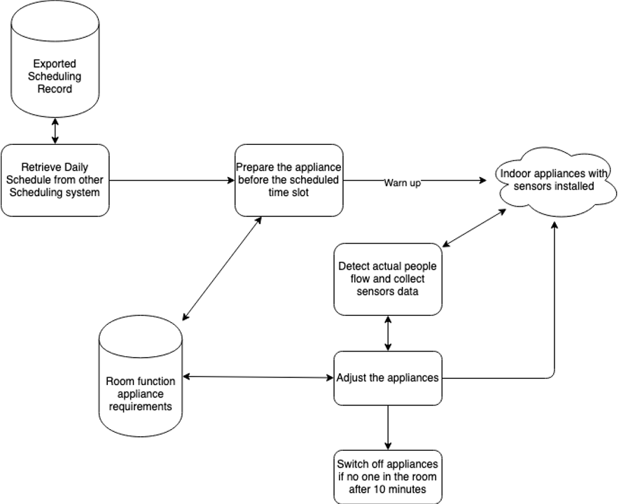
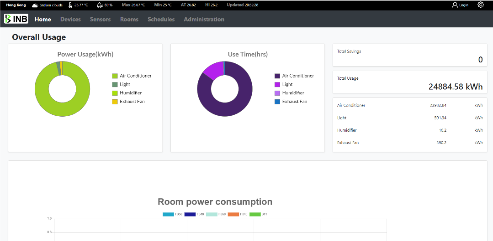
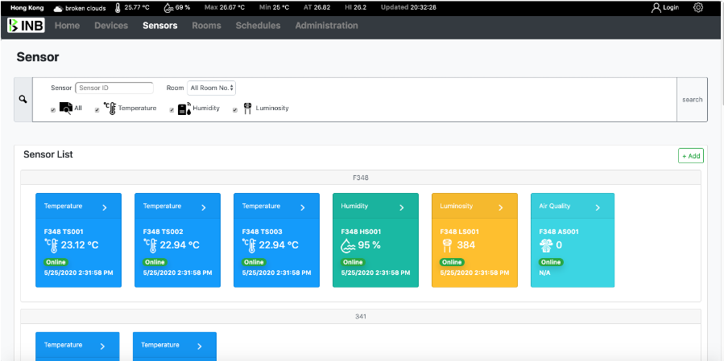
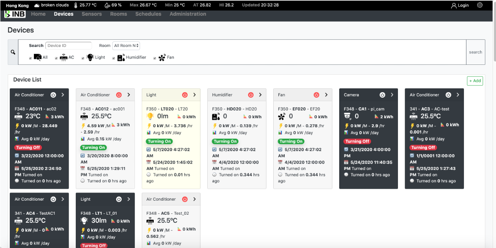
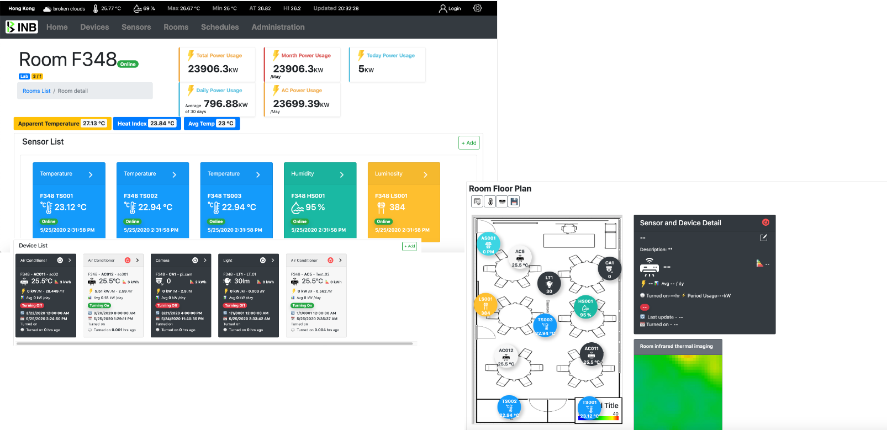
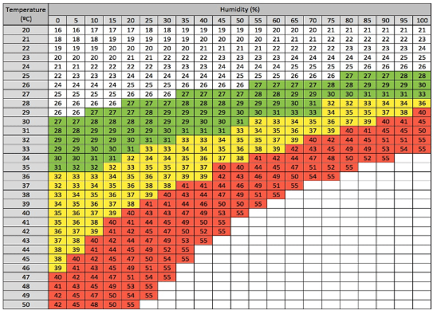
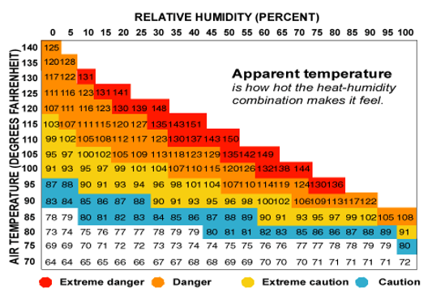

# Intelligent Energy Management System for Buildings INB

### Hong Kong Institute of Vocational Education
 

 

#### Features
- Retrieval of regional weather data from the existing OpenAPI (OpenWeatherMap), storing to DB for further analysis;

- Retrieval of outdoor weather data through Arduino  sensors installed outside the building, storing to DB for further analysis;

- Retrieval of indoor conditions through several IoT devices, the Arduino  sensors installed inside the rooms of the building to get data of the room and control by Raspberry Pi and return data to the server;

- Device control of lights and temperature by configured rule and artificial intelligence, change based on the analyzed regional and outdoor weather data, as well as indoor sensors and system rules.

- Dashboard interface for authorized users to view the building conditions and manage rules, with the import of timetables from the existing system(s).

- Power saving report and power-saving plan based on data analysis, reporting of electrical energy usage, visualize form for using data analysis.
 

#### Intelligent Energy Management Web system 
> Intelligent Energy Management Web system 

#### Scheduling system
> Scheduling system
 

#### System Architecture

> System architeture design
 

#### Hardware Diagram

> Hardware design

# The development code and mode here using the C# .net core 3.1.
#### Environment and library
C sharp Web App => source code 
**front end**
* Bootstrap v4.41
* Jquery v3.5.1
* Jquery-ui-1.12.1
* popper.js
* Chart.js
* heatmap.js
* javascript_Cookie
* Modernizr.js v2.8.3

**Back end**
* .net core 3.1
* MongoDB v4.2.6
* Python 3.7
* https://www.hangfire.io/
* OpenWeatherMap API

**Hardware**
* Raspberry pi4
* Arduino UNO REV3
* DS18B20 Digital Temperature Sensor
* DH11 Humidity and Temperature Sensor
* MDY26479 photoresistor Sensor
* Panasonic AMG8854 Specialized Sensor

# Hardware Prototype
#### Prototype circuit graph Hardware prototype

#### Hardware prototype model

#### Prototype circuit graph Hardware prototype

# Web Prototype
#### System Workflow (Overview)

#### Web system (Overview)

> Darsh Board
 

> Sensor List
 

> Device List
 

> Room Detail
 

# Heat Index & Apparent Temperature
#### Heat index 

#### Apparent Temperature

>  Apparent Temperature Formual 
>  Among them, AT is somatosensory temperature (° C), T is air temperature (° C), e is water pressure (hPa), V is wind speed (m / sec), and RH is relative humidity (%).
 
